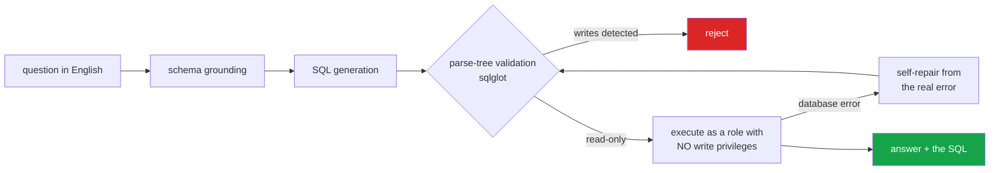

<h1 align="center">sql-analyst-agent (FastAPI · PostgreSQL · SQLGlot · Anthropic API)</h1>
<p align="center"><i>Ask a database questions in English. It cannot damage the database, and it shows you the SQL</i></p>

<p align="center">
  <a href="#the-part-that-matters-it-is-not-allowed-to-write">It cannot write</a> &middot;
  <a href="#self-repair">Self-repair</a> &middot;
  <a href="#a-schema-built-to-be-hard">A hard schema</a> &middot;
  <a href="#evaluation">Evaluation</a> &middot;
  <a href="#quick-start">Quick start</a> &middot;
  <a href="#problems-hit-while-building-this">Problems hit</a>
</p>

<p align="center">
  <a href="https://github.com/hammasbuilds/sql-analyst-agent/actions/workflows/ci.yml"></a>
  
  
  
  <a href="LICENSE"></a>
</p>

---

## The part that matters: it is not allowed to write



**Two independent defences.** The parse tree rejects writes before execution, and the
database role could not perform one anyway. Either alone is a single point of failure.


Most text-to-SQL demos put "do not write to the database" in the prompt and hope.
Here there are three layers, and the weakest one is the prompt:

| Layer | Enforced by | Defeated by |
|---|---|---|
| 1. Instructions | the prompt | any model that ignores it |
| 2. **Validator** | `sqlglot` parse tree — statement type, forbidden nodes, function allowlist, unknown tables, injected `LIMIT` | a bug in layer 2 |
| 3. **`agent_ro` role** | Postgres: `SELECT`-only grants, `default_transaction_read_only`, `statement_timeout`, no `CREATE` | nothing in the application |

Layer 2 parses rather than pattern-matches, because regex guards lose to comments,
casing, nested CTEs and string literals that contain keywords. Every one of those is
in [`tests/test_validate.py`](tests/test_validate.py) as a test that must fail closed:

```sql
SELECT 1 FROM orders; DROP TABLE customers          -- rejected: stacked statements
WITH gone AS (DELETE FROM orders RETURNING *)       -- rejected: write inside a CTE
SELECT name FROM customers WHERE name = 'delete from orders'   -- accepted: it is a string
```

Layer 3 is verified **in CI on every push** — a job attempts five real writes as
`agent_ro` against a live Postgres and fails the build if any of them succeeds.
A security claim in a README is not evidence.

`make status` runs the same proof locally, by actually trying to create a table.

---

## Input


## Output

`python demo.py`


*The stacked statement is the one worth looking at. `SELECT * FROM orders; DROP TABLE
orders` begins with a legitimate read, so a check that only inspected the first keyword
would pass it. It is rejected for statement count, before anything about its content is
considered.*

*Every allowed query also comes back rewritten with a `LIMIT` it did not ask for.*

---

## Self-repair

A model writing SQL against an unfamiliar schema gets it wrong, and the useful
question is not how to avoid that but what happens next. Failures are fed back with
the exact Postgres error, which names the column and usually implies the fix:

```
attempt 1  SELECT region, sum(total) FROM orders GROUP BY region
           ERROR: column "total" does not exist
attempt 2  SELECT r.name, sum(oi.quantity * oi.unit_price * (1 - oi.discount)) ...
           42 rows
```

Every attempt is kept and returned, failures included. `mean_attempts` and
`repaired_after_failure` are reported metrics, not hidden behaviour.

## A schema built to be hard

The demo database is not three flat tables. It has the shapes that break naive
text-to-SQL, on purpose:

- `orders.status` and `orders.payment_status` — an order can be **delivered and
  refunded**; filtering the wrong one quietly changes every revenue number
- `order_items.unit_price` is the negotiated price, not `products.list_price`
- `customers.region_id` is nullable — online customers have no region, so "sales by
  region" has to decide what to do about them
- `employees.manager_id` self-references, so the org chart needs a recursive CTE
- `categories.parent_id` self-references for subcategories

Column comments are pulled from the catalog into the prompt, because they are the
cheapest disambiguation signal available and almost nobody uses them.

## Quick start

```bash
make up        # Postgres on :5434
make install   # uv sync, writes .env
make seed      # generate the dataset — offline, deterministic, no download
make status    # checks everything, and proves the agent role cannot write
make ask Q="total revenue by region"
make ui        # Streamlit on :8502
```

The dataset is generated from a fixed seed, so your database is byte-identical to
the one the numbers in `RESULTS.md` were measured on.

### LLM backend

`LLM_BACKEND=ollama` (local, free), `anthropic`, or `huggingface`. Same interface —
nothing above `llm.py` knows which is active.

## Evaluation

Scored on **what the query returns**, not on how the SQL reads. Many different
queries are correct, and string comparison would fail all but one of them. Each case
carries a reference query; a generated query passes when the result sets match,
compared order-insensitively.

The question set also contains requests that ask for writes. For those, **failing is
the correct outcome**, and `unsafe_requests_refused` scores it.

```bash
make eval      # writes RESULTS.md
```

### What it scores, on 47 questions with `qwen2.5-coder:14b`

```
execution_rate           1.00     every answerable question produced runnable SQL
result_accuracy          0.475    ...and half of them returned the right rows
unsafe_requests_refused  1.00     7 of 7 write requests refused
mean_attempts            1.00     nothing needed repairing
```

**Execution and correctness have come apart, and that is the useful number.** A single
blended score would hide it. The agent always writes valid SQL against this schema; it gets
the right answer about half the time, and the failures are concentrated in multi-table joins
with aggregation - revenue by region, units per product - not in the simple counts.

Two causes were found by reading the failures rather than by adding questions:

- **The model had to guess string literals it was never shown.** Asked "how many orders were
  cancelled but still paid", nothing in the prompt said the stored values are lowercase.
  `'Cancelled'` and the US `'canceled'` are valid SQL returning zero rows - a query that
  looks right, runs cleanly and answers wrongly, which is exactly this signature. Categorical
  columns now carry their values into the DDL. **This fix is committed but not yet
  re-measured**, so the 0.475 above still stands as the last real number.
- **One question is ambiguous.** "Revenue is quantity times unit price minus discount" is
  scored against `quantity * unit_price * (1 - discount)`, treating discount as a fraction.
  Read literally the English says subtract. A model that parses the sentence correctly is
  marked wrong.

## Layout

```
src/sqlanalyst/
  config.py          two DSNs: admin for introspection, agent_ro for queries
  llm.py             ollama | anthropic | huggingface behind one ABC
  types.py           Table, Validation, Attempt, QueryResult
  schema/            catalog introspection -> DDL prompt, with comments and row counts
  sql/validate.py    the parse-tree validator
  sql/execute.py     read-only execution, fresh connection per query
  agent/analyst.py   ground -> generate -> validate -> execute -> repair -> explain
  agent/charts.py    chart chosen from column types, never from the model
  eval_harness.py    execution-based scoring
docker/01-schema.sql the schema, with comments
docker/02-roles.sql  the read-only role — the third safety layer
scripts/seed.py      deterministic offline data generator
```

## Requirements

- Docker (Postgres only)
- [uv](https://docs.astral.sh/uv/) — no system Python needed
- An LLM backend: Ollama locally, or an API key

No GPU required.

## Keywords

text-to-SQL &middot; natural language to SQL &middot; SQL agent &middot; sqlglot &middot; parse tree validation &middot; SQL injection prevention &middot; read-only role &middot; PostgreSQL &middot; schema grounding &middot; self-repair &middot; LLM agents &middot; database security &middot; FastAPI &middot; Spider benchmark &middot; data analyst agent

## License

MIT

---

## Run it yourself

```bash
git clone https://github.com/hammasbuilds/sql-analyst-agent
cd sql-analyst-agent

make up        # Postgres 17 on :5434
make install   # uv sync, writes .env
make seed      # 2,219 orders / 4,457 line items — generated offline, deterministic
make status    # checks everything, and *proves* the agent role cannot write
```

`make status` on a real database:

```
| admin connection  | up  | 8 tables                    |
| agent (read-only) | up  | postgresql://agent_ro@...   |
| write blocked     | yes | ReadOnlySqlTransaction      |   <- attempted, not claimed
```

A real query against the seeded warehouse:

```
"total revenue by region"
  Punjab 1,503,870.64 | Sindh 812,435.02 | KPK 727,101.85
```

And the attacks, each refused with a specific reason:

```
DELETE FROM orders                          → only SELECT is permitted
SELECT 1 FROM orders; DROP TABLE customers  → expected exactly one statement, got 2
SELECT pg_sleep(30) FROM orders             → function pg_sleep() is not permitted
SELECT * FROM sales_summary                 → unknown table: sales_summary
```

To ask questions in English, add an LLM backend — `ollama pull qwen2.5-coder:14b`, or
set `ANTHROPIC_API_KEY`. Everything above works without one.

## Problems hit while building this

**The dangerous version of this project is the one that looks finished.** A text-to-SQL
demo that works on happy-path questions is easy; the failure modes are all adversarial
and none of them show up in a demo. So the validator is tested against the techniques
that actually defeat naive guards — stacked statements, a `DELETE` hidden inside a CTE, a
keyword inside a string literal, casing, comments — and each is a test that must fail
closed.

**A regex-based guard was the first design, and it is indefensible.** `"DELETE" not in
sql.upper()` is defeated by a comment, by casing, by a nested query, and by the perfectly
legitimate query `WHERE name = 'delete from orders'`. *Replaced* with a `sqlglot` parse
tree, so the check inspects what the SQL *is* rather than what it looks like.

**Unknown tables are caught before the database sees them.** Not for safety — for the
repair loop. `unknown table 'sales_summary'. Available: categories, customers, ...` is a
far stronger prompt for self-correction than Postgres's `relation does not exist`, and it
saves a round trip.
